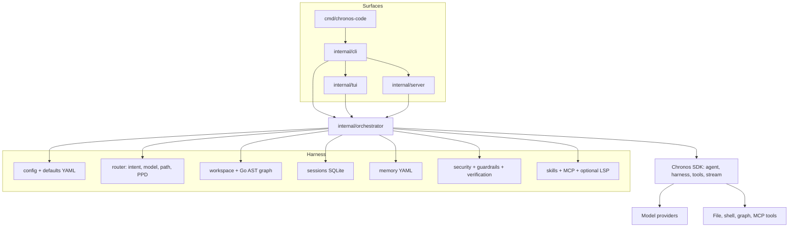

# Chronos Code

[](https://github.com/spawn08/chronos-code/actions/workflows/ci.yml)
[](https://github.com/spawn08/chronos-code/actions/workflows/release.yml)
[](https://github.com/spawn08/chronos-code/releases/latest)
[](go.mod)

YAML-native AI coding agent harness built on the [Chronos](https://github.com/spawn08/chronos) agentic framework.

Chronos Code is a single Go binary that loads YAML agents, skills, and policies, then runs them through Chronos. The product the user talks to is the `chronos-code` primary agent. Specialists are spawned on demand, or when the user `@mention`s them. Persistent memory, a Go code graph, MCP tools, guardrails, and a review-gated learning loop sit around that execution path.

## Contents

- [Features](#features)
- [Architecture](#architecture)
  - [Request path](#request-path)
  - [Package layout](#package-layout)
- [Quick start](#quick-start)
  - [Prerequisites](#prerequisites)
  - [Build](#build)
  - [Initialize a project](#initialize-a-project)
  - [Run](#run)
  - [Language server tools](#language-server-tools)
- [Commands](#commands)
- [Configuration](#configuration)
  - [Directory layout](#directory-layout)
  - [Precedence](#precedence)
  - [Verification](#verification)
  - [Native thinking](#native-thinking)
  - [Rollback](#rollback)
  - [Capability status](#capability-status)
- [Default agents](#default-agents)
- [Interactive TUI](#interactive-tui)
- [MCP and safety](#mcp-and-safety)
- [Development](#development)
  - [Token efficiency eval](#token-efficiency-eval)
  - [PPD routing](#ppd-routing)
- [Releases and versioning](#releases-and-versioning)
- [License](#license)

## Features

- **YAML-first configuration** — agents, skills, guardrails, security policies, routing, and MCP servers defined in YAML, not Go
- **Primary agent plus specialists** — Chronos Code stays the conversation partner; coder, planner, PPD planner, reviewer, debugger, researcher, architect, and explainer run via `spawn_subagent` or `@agent_id`
- **Go code graph** — default indexer uses `go/packages` and the Go AST; tree-sitter is an optional `treesitter` build tag
- **Tiered routing** — T0 graph tools before T1 cheap models before T2 frontier models; complexity paths bound tool-call counts
- **Self-learning loop** — traces sessions into reviewable YAML suggestions (`learn accept` / `learn reject`); automatic distillation is off by default
- **MCP** — stdio and HTTPS SSE servers from `.mcp.json`; tools are namespaced and require approval by default
- **Guardrails and a security floor** — injection detection, secret scanning, PII filtering, cost caps; project policy and `--yolo` cannot weaken the embedded floor
- **Two surfaces** — interactive TUI/CLI and `chronos-code serve` HTTP API; SQLite is the default store, PostgreSQL needs the `postgres` build tag
- **Sessions and memory** — resumable SQLite sessions; project/user/feedback memory as git-diffable YAML with deterministic text recall
- **Embedded defaults** — first run works without files; `chronos-code init` exports editable YAML into `.chronos-code/`

## Architecture

`cmd/chronos-code` is a thin `main`. `internal/cli` dispatches commands. Interactive REPL, headless `run`, and `serve` all construct one **Orchestrator**. The orchestrator resolves YAML (CLI flags, env, project, user, embed), indexes the workspace graph, wires Chronos agents, and executes turns.

The TUI and HTTP server are surfaces, not a second runtime. They do not talk to Chronos directly.



### Request path

1. **CLI** starts a REPL, a one-shot `run`, or HTTP `serve`.
2. **Orchestrator** loads config, agents, skills, security policy, routing, graph, session, and memory stores.
3. **Router** classifies the user message with YAML regexes first (T0), optionally a cheap model (T1). It selects a model tier and an implementation path (`low` / `medium` / `high`). The conversation agent stays `chronos-code` unless the user `@mention`s a specialist or PPD `enabled` mode delegates qualifying work to `ppd-planner`.
4. **Chronos** runs the agent loop: graph tools (T0), ranged file reads (T1), shell and writes (T2). Guardrails and the security policy wrap tool calls. MCP servers that fail to start do not block healthy servers or chat.
5. **After the turn**, sessions persist, explicit memory intents may write YAML, and learning may emit a pending suggestion for human review.

### Package layout

| Layer | Package | Role |
|-------|---------|------|
| Entry | `cmd/chronos-code` | Binary `main` |
| Surfaces | `internal/cli` | Command dispatch (no Cobra) |
| | `internal/tui` | Bubble Tea REPL: streaming, approvals, slash commands |
| | `internal/server` | HTTP API (`/v1/chat`, sessions, memory, teams) |
| Core | `internal/orchestrator` | Agent lifecycle, routing application, turn execution |
| | `internal/config` | YAML discovery and merge |
| | `internal/defaults` | Embedded agents, skills, guardrails, routing (`go:embed`) |
| | `internal/router` | Intent patterns, model routing, complexity paths, PPD policy |
| Workspace | `internal/workspace` | Project root, ignore rules, file indexing |
| | `internal/graph` | Go AST graph by default; tree-sitter behind `treesitter` |
| | `internal/projectdocs` | Watches project docs for context |
| | `internal/lsp` | Optional `lsp` tag: diagnostics, hover, references, rename preview |
| Context | `internal/session` | Session persistence and resume |
| | `internal/memory` | Local YAML memory (project / user / feedback) |
| | `internal/plan` | Durable PPD plan store and scheduler |
| | `internal/skills` | Skill discovery and selection |
| | `internal/activation`, `internal/attention`, `internal/incctx`, `internal/toolcompress` | Context window budgeting and compression |
| Safety | `internal/security` | Path/shell policy, permissions, hooks, sandbox |
| | `internal/guardrail` | YAML guardrail engine |
| | `internal/verification` | Report/enforce verification policy |
| | `internal/budget` | Token and USD caps |
| | `internal/auth` | API keys, OAuth, keychain, SSO |
| Integrations | `internal/mcpdiscover` | `.mcp.json` load, test, redact, runtime |
| | `internal/learning` | Trace → suggestion YAML; apply only after review |
| | `internal/teambuilder` | Multi-agent team definitions |
| | `internal/eval` | Offline token-efficiency and PPD eval harness |

Chronos itself (`github.com/spawn08/chronos`) is a **library**: agent SDK, harness, tool runtime, streaming, and storage adapters. Chronos Code does not reimplement that loop.

## Quick start

### Prerequisites

- Go 1.26+
- CGO enabled (SQLite)
- [Chronos](https://github.com/spawn08/chronos) as a sibling checkout, or change the `go.mod` `replace` directive

### Build

```bash
make build        # produces bin/chronos-code
```

### Initialize a project

```bash
chronos-code init
```

Writes `.chronos-code/` with agent YAML, skills, guardrails, routing, and security policy. Skip this to run on embedded defaults.

### Run

```bash
chronos-code                 # interactive TUI
chronos-code run "message"   # one shot
chronos-code serve           # HTTP API, default :8430
```

### Language server tools

Build with `go build -tags lsp ./...` to register `lsp_diagnostics`, `lsp_hover`, `lsp_references`, and `lsp_rename_preview`. Supported servers: `gopls`, `typescript-language-server --stdio`, `pyright-langserver --stdio`, `rust-analyzer`.

Servers start lazily on first use. A missing server is non-fatal. Builds without the `lsp` tag keep the same fallback and register no LSP tools.

## Commands

```text
chronos-code                         Start interactive REPL
chronos-code run <message>           One task, then exit
chronos-code init                    Export .chronos-code/ into the project
chronos-code login / logout / whoami Provider credentials
chronos-code providers               List resolvable providers
chronos-code agents list             List resolved agents
chronos-code config show|validate    Resolved config
chronos-code session list|delete|export
chronos-code memory list|search|forget
chronos-code mcp add|list|test|remove
chronos-code learn suggest|list|show|accept|reject
chronos-code eval run|ppd
chronos-code team list|run
chronos-code plan … --db <path>      Durable plan database ops
chronos-code skills list|show
chronos-code serve                   HTTP server
chronos-code version
```

Useful flags: `-c/--config`, `--debug`, `--stream` / `--no-stream`, `--permission-mode`, `--yolo`, `--budget <usd>`, `--resume <session-id>`, `--json` (headless).

`--yolo` auto-approves policy-allowed tools. It never overrides deny rules or destructive confirmations.

## Configuration

### Directory layout

```text
.chronos-code/
├── config.yaml          # model, storage, memory, learning, verification
├── routing.yaml         # intent, models, complexity paths, PPD
├── security.yaml        # path allowlists, shell restrictions, MCP trust
├── agents/              # chronos-code.yaml, coder.yaml, …
├── skills/
├── guardrails/
├── memory/              # project.yaml, user.yaml, feedback.yaml
└── learned/             # pending learning suggestions
```

Project MCP servers live in `.mcp.json` (not under `.chronos-code/`).

### Precedence

Highest to lowest:

1. CLI flags
2. Supported provider/server environment variables
3. `.chronos-code/config.yaml` (project)
4. `~/.chronos-code/config.yaml` (user)
5. Embedded defaults

### Verification

CLI, TUI, and HTTP share the same switch:

```yaml
verification:
  mode: report # report or enforce
```

`enforce` refuses a successful completion when the runtime has verification obligations without current evidence. It does not invent checks.

### Native thinking

Off by default. Enable in YAML or with `/think` in the TUI:

```yaml
defaults:
  reasoning:
    strategy: cot
    native: true          # Anthropic extended thinking, OpenAI reasoning effort
    effort: medium        # low, medium, or high
    budget_tokens: 4096
    summary: true         # stream thinking summaries in the TUI
```

`/model` lists models. Tab after `/model ` autocompletes authorized provider/model IDs.

### Rollback

Independent YAML switches. Sessions, memories, learned patterns, and `.mcp.json` stay on disk:

```yaml
session:
  recall_prior_summaries: false
  context_report: false
learning:
  pattern_injection: false
mcp:
  discovery_enabled: false
```

Restart after changing these. `memory.enabled: false` stops persist and recall. The embedded security floor stays on. Restore `.mcp.json` from its same-directory atomic-write backup if a mutation must be reversed.

### Capability status

| Capability | Status |
|---|---|
| Go code graph, SQLite sessions, deterministic YAML memory | Default |
| Tree-sitter graph | Optional `treesitter` build |
| PostgreSQL storage | Optional `postgres` build |
| LSP tools | Optional `lsp` build |
| PPD policy | Live `enabled` in embedded `routing.yaml`; `shadow` observes without invoking `ppd-planner`; `disabled` skips it |
| Verification | `report` by default; `enforce` is opt-in |
| Learning suggestions | On, human review required; `auto_distill: false` |
| Vector recall and branchable sessions | Roadmap |

## Default agents

| Agent | Role | Typical tier |
|-------|------|----------------|
| `chronos-code` | Primary conversation agent; orients, routes, synthesizes | Frontier |
| `coder` | Implement, test, iterate | Frontier |
| `planner` | Task decomposition | Frontier |
| `ppd-planner` | Read-only durable DAG for multi-package / high-risk work | Frontier |
| `reviewer` | Bugs, security, style | Frontier |
| `debugger` | Failures from errors and traces | Frontier |
| `researcher` | Read-only search | Cheap |
| `architect` | Design and structure | Frontier |
| `explainer` | Explain code and concepts | Cheap |

Bypass the router:

```text
@reviewer check my last commit
@debugger why is TestAuth failing
@ppd-planner decompose this migration
```

## Interactive TUI

Mouse wheel scrolls the transcript by default. Shift-drag to select, then copy with the terminal shortcut (`Cmd+C` on macOS). `/mouse` switches to unshifted drag-select instead of wheel capture.

`/copy`, `Ctrl+Y`, and `Ctrl+Shift+C` copy the last assistant reply as UTF-8. With no last reply they copy the visible transcript. `/copy visible` / `/copy all` copy the pane or the full conversation. `/copy code` and `Ctrl+Shift+X` copy the last fenced block (`/copy code 1` copies the first). `Ctrl+V` uses the same clipboard adapter. A failed clipboard write is never reported as success.

Tool calls in a turn collapse to a count plus the latest (or still-running / failed) line. `Ctrl+O` expands them.

While scrolled away from the live tail, streaming does not repaint the pane, so a selection stays stable until `Ctrl+End`.

| Command | Effect |
|---------|--------|
| `/login` or `Ctrl+L` | Claude Code / enterprise reuse, Codex/ChatGPT, API keys, OAuth |
| `/whoami` | Effective credential source |
| `/context` | Source names, counts, budgets, omission reasons (never memory bodies or secrets) |
| `/resume` | Continue the latest session (`--resume <id>` from CLI) |
| `/compact` | Summarize history |
| `/rewind` | Undo the last `file_write` |
| `/plan on` / `/plan off` | Block writes and shell until plan mode is off |
| `/learn` | Review-gated suggestions |

Status bar shows verification mode and the last route. `chronos-code run --json` prints one JSON object.

Explicit memory intents: `remember <category>: <fact>`, `forget: <mem_ID>`, `recall-past: <query>`. Casual uses of “remember”, “always”, or “never” do not persist.

## MCP and safety

Manage `.mcp.json` with `chronos-code mcp add`, `list`, `test`, and `remove`. Only stdio and HTTPS SSE are accepted. Credential-like arguments and query values must be `${ENV_VAR}` references; list and test output redacts them.

At startup, denied, untrusted, malformed, or unavailable servers do not block healthy servers or chat. MCP tools are namespaced, require approval by default, and close during cleanup.

The embedded security floor cannot be weakened by project policy or `--yolo`. Unknown models run only without a USD cap; a positive cap fails closed before a provider call when pricing is unavailable.

## Development

```bash
make build        # bin/chronos-code
make test         # go test -race
make eval         # token-efficiency eval vs baseline.json
make fmt
make vet
make tidy
make clean
make install      # $GOPATH/bin
```

### Token efficiency eval

`make eval` replays offline fixtures and compares paired totals with `benchmark/eval/baseline.json`. The gate fails on contract errors, stale baseline totals, or an optimized-token regression greater than 10%.

`benchmark/eval/report.md` is a synthetic fixture-replay result, not a comparison against Chronos Code or an external tool. A performance claim needs paired model runs on the same tasks, model, corpus revision, and success gate.

`benchmark/ppd/results.json` is `invalid`: no real model was invoked. It must not support a PPD quality or efficiency claim. Invalid runs are excluded from successful-task denominators.

### PPD routing

Embedded `routing.yaml` sets `ppd.mode: enabled`. Qualifying work (high-risk or high-complexity, explicit PPD, resume, or breadth past file/package/call thresholds) is delegated to `ppd-planner`. Use `shadow` to record decisions without invoking the specialist, or `disabled` to skip the policy.

```bash
chronos-code eval ppd --validate-only   # registration only, not efficacy
chronos-code eval ppd --report          # requires completed real-model evidence
```

`--report` fails closed on the checked-in invalid placeholder.

## Releases and versioning

Chronos Code follows [semantic versioning](https://semver.org/) (`vMAJOR.MINOR.PATCH`).

`make build` and `make build-release` stamp the binary from `git describe`. An untagged commit reports a `-dirty` / commit-suffixed dev version (`internal/cli.Version`):

```bash
chronos-code version
```

A `v*` tag runs [`.github/workflows/release.yml`](.github/workflows/release.yml): tests, then linux/darwin/windows amd64 and arm64 archives with `sha256sum` manifests on a [GitHub Release](https://github.com/spawn08/chronos-code/releases).

Every push and PR to `main` runs [`.github/workflows/ci.yml`](.github/workflows/ci.yml): build, lint, `go test -race`, release-binary size gate, and the token-efficiency eval.

## License

Same license as [Chronos](https://github.com/spawn08/chronos).
