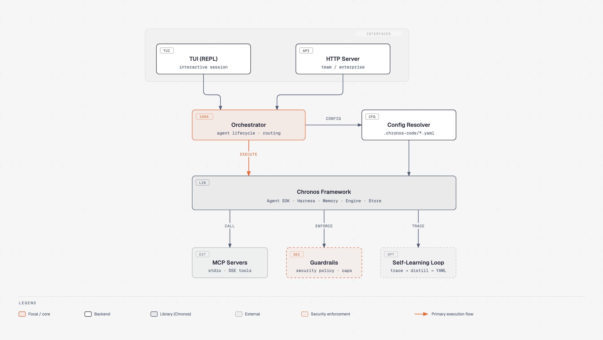

# Chronos Code

[](https://github.com/spawn08/chronos-code/actions/workflows/ci.yml)
[](https://github.com/spawn08/chronos-code/actions/workflows/release.yml)
[](https://github.com/spawn08/chronos-code/releases/latest)
[](go.mod)

YAML-native AI coding agent harness built on the [Chronos](https://github.com/spawn08/chronos) agentic framework.

Chronos Code provides a configuration-driven experience for defining, composing, and running AI coding agents — with MCP integration, tool calling, subagent delegation, persistent memory, guardrails, and a self-learning loop that distills past executions into reusable YAML definitions.

## Contents

- [Features](#features)
- [Quick Start](#quick-start)
- [Adaptive Context, MCP, And Safety](#adaptive-context-mcp-and-safety)
- [Architecture](#architecture)
- [Configuration](#configuration)
- [Default Agents](#default-agents)
- [Development](#development)
- [Releases and Versioning](#releases-and-versioning)
- [License](#license)

## Features

- **YAML-first configuration** — agents, skills, guardrails, security policies, and MCP servers defined entirely in YAML
- **Code graph indexing** — Go AST-based indexing by default; optional tree-sitter support requires the `treesitter` build tag
- **Tiered model routing** — cheap models for search/explanation, frontier models for reasoning/coding
- **Self-learning loop** — analyzes execution traces and generates improved agent/skill YAML (not fine-tuning)
- **Full MCP support** — connect to external tool servers via stdio or SSE
- **Built-in agents** — Chronos Code (primary) plus coder, planner, PPD planner, reviewer, debugger, researcher, architect, explainer
- **Complexity paths** — low/medium/high graphs bound tool calls; models and specialists follow the task
- **TUI login** — `/login` or Ctrl+L for Claude Code / Claude Enterprise reuse, Codex/ChatGPT subscription, API keys, and enterprise OAuth
- **Guardrail presets** — injection detection, secret scanning, PII filtering, cost caps
- **Dual-mode deployment** — interactive CLI and authenticated HTTP server; SQLite is the default storage and PostgreSQL requires the `postgres` build tag
- **Session management** — resumable and inspectable conversation sessions
- **Persistent memory** — project- and tenant-scoped local memory with deterministic text recall
- **Embedded defaults** — zero-config first run; `chronos-code init` exports editable YAML

## Quick Start

### Prerequisites

- Go 1.26+
- CGO enabled (required for SQLite)
- [Chronos](https://github.com/spawn08/chronos) cloned as a sibling directory (or adjust `go.mod` replace directive)

### Build

```bash
make build        # produces bin/chronos-code
```

### Initialize a project

```bash
chronos-code init
```

Creates a `.chronos-code/` directory with default agent definitions, skills, guardrails, and security policies — all editable YAML.

### Run

```bash
chronos-code
```

Without `init`, embedded defaults are used automatically.

### Language server tools

Build with `go build -tags lsp ./...` to include the `lsp_diagnostics`, `lsp_hover`, `lsp_references`, and `lsp_rename_preview` tools. Supported servers are `gopls` for Go, `typescript-language-server --stdio` for JavaScript/TypeScript, `pyright-langserver --stdio` for Python, and `rust-analyzer` for Rust.

Language servers are discovered and started lazily on the first tool or referenced-file diagnostics request. A missing server is non-fatal: the corresponding request is skipped or reports that no server is available, and Chronos Code continues without LSP diagnostics. Builds without the `lsp` tag retain the same fallback behavior and register no LSP tools.

## Adaptive Context, MCP, And Safety

Explicit memory intents use `remember <category>: <fact>`, `forget: <mem_ID>`,
or `recall-past: <query>`. Incidental uses of words such as `remember`,
`always`, and `never` do not persist memory. `/context` shows source names,
counts, budgets, and safe omission reasons; it never displays memory bodies,
prior-session text, hidden prompts, tool arguments, environment values, or
credentials.

`/copy`, `Ctrl+Y`, and `Ctrl+Shift+C` copy the last assistant response to the
host clipboard without changing its UTF-8 bytes. If there is no last response,
they copy the currently visible transcript instead. `/copy visible` and
`/copy all` copy the on-screen pane or the full conversation. `/copy code`
and `Ctrl+Shift+X` copy the last fenced code block (`/copy code 1` copies the
first). `Ctrl+V` uses the same native clipboard adapter.

Tool calls in a turn collapse to a count plus the latest (or still-running /
failed) line. `Ctrl+O` expands or collapses those details.

Mouse capture starts **off**, so drag-select plus the terminal copy shortcut
(`Cmd+C` on macOS) works immediately. Use `/mouse` when you want the wheel to
scroll the transcript; then hold Shift while dragging to select.

`/resume` continues the latest session (`--resume <id>` from the CLI).
`/compact` summarizes history. `/rewind` undoes the last `file_write`.
`/plan on` blocks writes and shell until `/plan off`. `/learn` lists
review-gated suggestions (`accept`/`reject`). The status bar shows
verification mode and the last route. `chronos-code run --json` prints one
JSON object. OAuth and Claude Code / Codex credential reuse remain on the
existing auth precedence chain (`/whoami`, `chronos-code login`).

Manage the project `.mcp.json` with `chronos-code mcp add`, `list`, `test`,
and `remove`. Only stdio and HTTPS SSE servers are accepted. Credential-like
arguments and query values must use `${ENV_VAR}` references; list and test
output redacts them. At startup, denied, untrusted, malformed, or unavailable
servers do not block healthy servers or chat. MCP tools are namespaced,
require approval by default, and are closed during cleanup.

The embedded security floor cannot be weakened by project policy or `--yolo`.
Unknown models run only without a USD cap; a positive cap fails closed before a
provider call when pricing is unavailable.

### Rollback

The following YAML switches disable optional consumers independently while
preserving sessions, memories, learned patterns, and `.mcp.json` data:

```yaml
session:
  recall_prior_summaries: false
  context_report: false
learning:
  pattern_injection: false
mcp:
  discovery_enabled: false
```

Restart Chronos Code after changing these values. `memory.enabled: false`
disables explicit memory persistence and recall. The embedded security floor
remains active during every rollback. Restore a previous `.mcp.json` from its
same-directory atomic-write backup if a mutation must be reversed. Disabling
the clipboard adapter must not report a successful copy; `/mouse` can disable
capture without removing keyboard scrolling.

## Architecture

The TUI and HTTP server both hand requests to a single Orchestrator, which
resolves YAML configuration and executes through the Chronos framework
library. MCP tool servers, guardrail enforcement, and the self-learning loop
sit alongside execution as cross-cutting concerns.

<p align="center">
  
</p>

<p align="center"><sub>Vector source: <a href="docs/assets/architecture.svg">architecture.svg</a></sub></p>

### Package Layout

| Package | Purpose |
|---------|---------|
| `cmd/chronos-code` | Binary entry point |
| `internal/cli` | Command dispatch |
| `internal/config` | YAML config discovery and resolution |
| `internal/defaults` | Embedded agent/skill/guardrail YAML (`go:embed`) |
| `internal/orchestrator` | Agent lifecycle and message routing |
| `internal/tui` | Terminal interface (REPL, streaming, permissions) |
| `internal/server` | HTTP server for team/enterprise deployment |
| `internal/graph` | Tree-sitter code graph indexing |
| `internal/memory` | Local-first memory with optional vector recall |
| `internal/learning` | Self-learning loop (trace → distill → YAML) |
| `internal/session` | Session persistence and resumption |
| `internal/workspace` | Project detection, file indexing, .gitignore |
| `internal/auth` | Provider authentication (API key, OAuth, keychain) |
| `internal/security` | Security policy enforcement |
| `internal/guardrail` | YAML-configured guardrail engine |
| `internal/eval` | Token efficiency evaluation harness |
| `internal/budget` | Token budget tracking and enforcement |
| `internal/activation` | Activation buffer for context management |
| `internal/attention` | Attention budgeting |
| `internal/toolcompress` | Tool result compression |
| `internal/incctx` | Incremental context loading |

## Configuration

All configuration lives in `.chronos-code/` at the project root:

```
.chronos-code/
├── config.yaml          # Main config (model, storage, memory, learning)
├── agents/              # Agent definitions
│   ├── coder.yaml
│   ├── reviewer.yaml
│   ├── planner.yaml
│   └── ...
├── skills/              # Skill manifests
├── guardrails/          # Guardrail presets (default, strict, permissive)
├── security.yaml        # Path allowlists, shell restrictions, MCP trust
├── memory/              # Persistent memory (YAML, human-readable)
└── learned/             # Self-learning loop output
```

Config precedence (highest to lowest):
1. CLI flags
2. Supported provider/server environment variables
3. `.chronos-code/config.yaml` (project)
4. `~/.chronos-code/config.yaml` (user global)
5. Embedded defaults

Verification defaults to report-only mode and is shared by CLI, TUI, and HTTP:

```yaml
verification:
  mode: report # report or enforce
```

`enforce` blocks a successful completion when the runtime has verification
obligations without current supporting evidence. The switch does not invent or
implicitly run checks; obligations and evidence must come from the execution
runtime.

### Capability Status

| Capability | Status |
|---|---|
| Go code graph, SQLite sessions, deterministic memory recall | Default |
| Tree-sitter graph support | Optional `treesitter` build |
| PostgreSQL storage | Optional `postgres` build |
| PPD complexity policy and specialist | Experimental; `shadow` by default |
| Verification enforcement | Optional configuration; `report` by default |
| Learning suggestions | Default with human review; automatic distillation disabled |
| Vector recall and branchable sessions | Roadmap |

## Default Agents

| Agent | Role | Model Tier |
|-------|------|------------|
| `coder` | Primary coding agent — read, write, test, iterate | Frontier |
| `planner` | Task decomposition and execution planning | Frontier |
| `reviewer` | Code review for bugs, security, and style | Frontier |
| `debugger` | Diagnose failures from error output and traces | Frontier |
| `researcher` | Read-only codebase exploration | Cheap |
| `architect` | High-level design and structural guidance | Frontier |
| `explainer` | Code and concept explanation | Cheap |

Switch agents explicitly with `@agent_id`:
```
@reviewer check my last commit
@debugger why is TestAuth failing
```

## Development

```bash
make build        # build binary
make test         # run tests with -race
make eval         # run token efficiency eval suite
make fmt          # format code
make vet          # static analysis
make tidy         # go mod tidy
make clean        # remove build artifacts
make install      # install to $GOPATH/bin
```

### Token Efficiency Eval

`make eval` runs the deterministic, offline fixture-replay suite and compares
its paired totals with `benchmark/eval/baseline.json`. The gate fails on
contract failures, malformed or stale baseline totals, or an optimized-token
regression greater than 10%.

The checked-in `benchmark/eval/report.md` is a synthetic fixture-replay result,
not a valid comparison with Chronos Code or an external baseline tool. A
performance claim requires paired model runs against both tools on the same
tasks, model, corpus revision, and success gate.

`benchmark/ppd/results.json` records the registered four-arm, three-repeat PPD
matrix, but its status is `invalid`: no real model was configured or invoked.
It contains no usage, outcome, or verification measurements, and invalid runs
are excluded from successful-task efficacy denominators. It does not support a
PPD quality, efficiency, or rollout claim.

PPD routing therefore defaults to observational `shadow` mode in
`.chronos-code/routing.yaml`; qualifying requests are recorded as decisions and
are not delegated to the PPD specialist. Do not change the mode to `enabled`
until reproducible paired real-model runs provide valid evidence.

Use `chronos-code eval ppd --validate-only` to validate the registered matrix.
This does not validate efficacy. Use `chronos-code eval ppd --report` to require
completed real-model evidence, a current baseline manifest, and the registered
success/token/model-call thresholds; it fails closed for the checked-in invalid
placeholder.

## Releases and Versioning

Chronos Code follows [semantic versioning](https://semver.org/) (`vMAJOR.MINOR.PATCH`).
`make build` and `make build-release` stamp the binary from `git describe`, so
a build off an untagged commit reports a `-dirty`/commit-suffixed dev version
(`internal/cli.Version`) rather than a release number:

```bash
chronos-code version
```

Pushing a `v*` tag runs [`.github/workflows/release.yml`](.github/workflows/release.yml),
which re-runs the full test suite and then cross-compiles and publishes
`chronos-code` for linux/darwin/windows on amd64 and arm64, each archived with
a `sha256sum` manifest, attached to a [GitHub Release](https://github.com/spawn08/chronos-code/releases).
Every push and pull request against `main` runs [`.github/workflows/ci.yml`](.github/workflows/ci.yml):
build, lint, `go test -race`, a release-binary size gate, and the token
efficiency eval.

## License

Same license as [Chronos](https://github.com/spawn08/chronos).
