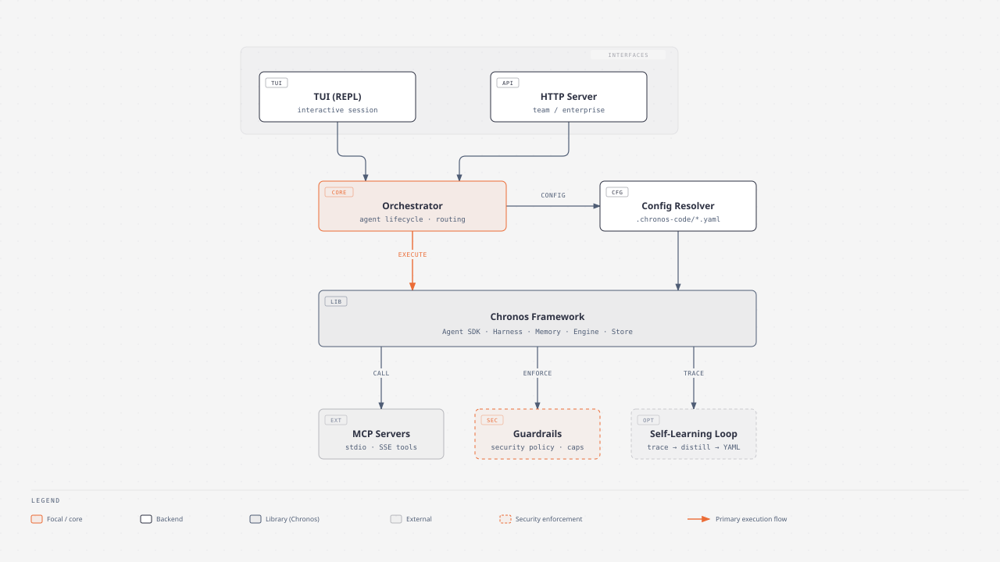

<div align="center">

# Chronos Code

**A YAML-native AI coding agent harness, shipped as a single Go binary.**

Define agents, skills, guardrails, and routing in YAML. Run them from the terminal, a headless CLI, or an HTTP API,
backed by a multi-language code graph, persistent memory, and a security floor that project config can't weaken.

[](https://github.com/spawn08/chronos-code/actions/workflows/ci.yml)
[](https://github.com/spawn08/chronos-code/actions/workflows/release.yml)
[](https://github.com/spawn08/chronos-code/releases/latest)
[](go.mod)
[](https://spawn08.github.io/chronos-code/)

[**Documentation**](https://spawn08.github.io/chronos-code/) ·
[**Install**](#installation) ·
[**Quick start**](#quick-start) ·
[**Architecture**](#architecture) ·
[**Releases**](https://github.com/spawn08/chronos-code/releases)

</div>

---

## Overview

Chronos Code is an AI coding agent built on the [Chronos](https://github.com/spawn08/chronos) agentic framework. You talk to one primary agent, `chronos-code`. It spawns specialists (coder, reviewer, debugger, and others) when needed, or when you `@mention` one.

Everything you'd normally tune in code lives in YAML: agents, skills, guardrails, security policy, model routing, and MCP servers. It works on first run with embedded defaults. `chronos-code init` exports those defaults into your project so you can edit them.

## Highlights

| | |
|---|---|
| 🧩 **YAML-first** | Agents, skills, guardrails, security policy, routing, and MCP servers are declared in YAML, not Go. |
| 🤝 **Primary agent + specialists** | `chronos-code` owns the conversation. Specialists run via `spawn_subagent` or `@agent_id`. |
| 🕸️ **Code graph** | Go via `go/parser`, plus 17 languages through a pure-Go tree-sitter runtime, with cross-repo federation. Included in every build. |
| 🪜 **Tiered routing** | Graph tools (T0) first, then cheap models (T1), then frontier models (T2). Complexity paths cap tool-call counts. |
| 🧠 **Sessions & layered memory** | Resumable SQLite sessions with compaction checkpoints. Episodic, procedural, semantic, and org-scoped memory. |
| 🛡️ **Security floor** | Injection detection, secret scanning, PII filtering, and cost caps. Project policy and `--yolo` can't weaken them. |
| 🔌 **MCP, both ways** | Consumes stdio and HTTPS SSE servers from `.mcp.json`, and serves its own code graph to other MCP hosts. |
| 📈 **Review-gated learning** | Turns session traces into YAML suggestions that you accept or reject. Nothing is applied automatically. |
| 🖥️ **Three surfaces, one runtime** | Interactive TUI, headless `run`, and an HTTP API (`serve`) all share one orchestrator. |

## Installation

Prebuilt binaries for **Linux, macOS, and Windows** (amd64 and arm64) come with every [tagged release](https://github.com/spawn08/chronos-code/releases).

**macOS / Linux**

```bash
curl -fsSL https://raw.githubusercontent.com/spawn08/chronos-code/main/scripts/install.sh | bash
```

**Windows (PowerShell)**

```powershell
irm https://raw.githubusercontent.com/spawn08/chronos-code/main/scripts/install.ps1 | iex
```

The installers detect your OS and architecture, download the matching archive, check it against the release's `SHA256SUMS`, and install `chronos-code` to `~/.local/bin`.

| Variable | Purpose | Default |
|---|---|---|
| `VERSION` | Release tag to install, e.g. `v0.7.0` | latest |
| `INSTALL_DIR` | Install location | `~/.local/bin` |

On Windows, use `$env:VERSION` / `$env:INSTALL_DIR`. If the script warns that the install directory isn't on `PATH`, add it.

<details>
<summary><b>Build from source</b></summary>

**Requirements:** Go 1.26+. No cgo needed; every build is pure Go. You also need a [Chronos](https://github.com/spawn08/chronos) checkout next to this repo (or edit the `replace` directive in `go.mod`).

```bash
git clone https://github.com/spawn08/chronos.git
git clone https://github.com/spawn08/chronos-code.git
cd chronos-code
make build          # → bin/chronos-code
make install        # → $GOPATH/bin
```

Every build, including release archives, ships the same parsers (Go plus 17 tree-sitter languages), SQLite sessions and FTS, memory, hooks, and the TUI. CI enforces a 56 MiB size limit on the binary.

Optional build tags:

| Tag | Adds |
|---|---|
| `lsp` | `lsp_diagnostics`, `lsp_hover`, `lsp_references`, `lsp_rename_preview`, backed by `gopls`, `typescript-language-server`, `pyright-langserver`, or `rust-analyzer`. Servers start lazily; a missing server doesn't stop anything else. |
| `postgres` | PostgreSQL storage backend (SQLite is the default). |

</details>

## Quick start

```bash
chronos-code login           # configure a provider (Anthropic, OpenAI, Azure, …)
chronos-code                 # launch the interactive TUI
```

A few more common starting points:

```bash
chronos-code run "add table-driven tests for internal/router"   # one-shot, then exit
chronos-code run --json "summarize this repo"                    # machine-readable output
chronos-code init                                                # export editable YAML to .chronos-code/
chronos-code serve                                               # HTTP API on :8430
```

In the TUI, mention a specialist to skip the router:

```text
@reviewer check my last commit
@debugger why is TestAuth failing
@delivery-strategist propose the next evidence-driven frontier for this migration
```

## Architecture

<p align="center">
  
</p>

`cmd/chronos-code` is a thin `main`, and `internal/cli` dispatches commands. The REPL, headless `run`, and `serve` each build a single **Orchestrator**. The orchestrator resolves configuration, indexes the workspace graph, wires up Chronos agents, and executes turns. The TUI and HTTP server are front ends to that runtime; they never call Chronos directly.

Chronos (`github.com/spawn08/chronos`) is used as a **library**: agent SDK, harness, tool runtime, streaming, and storage adapters. Chronos Code builds on its agent loop instead of reimplementing it.

### Request lifecycle

1. **Surface.** The CLI starts a REPL, a one-shot `run`, or `serve`.
2. **Orchestrator.** Loads config, agents, skills, security policy, routing, graph, session, and memory stores.
3. **Router.** Classifies the message with YAML regexes (T0), optionally checked by a cheap model (T1). It picks a model tier and an implementation path (`low` / `medium` / `high`). `chronos-code` keeps the conversation unless you `@mention` a specialist.
4. **Chronos agent loop.** Order of escalation: graph tools (T0), then ranged file reads (T1), then shell and writes (T2). Guardrails and the security policy wrap every tool call. If an MCP server fails, healthy servers and chat keep working.
5. **Post-turn.** The session is persisted, explicit memory intents are written, and learning may emit a pending suggestion for review.

<details>
<summary><b>Package layout</b></summary>

| Layer | Package | Role |
|---|---|---|
| Entry | `cmd/chronos-code` | Binary `main` |
| Surfaces | `internal/cli` | Command dispatch (no Cobra) |
| | `internal/tui` | Bubble Tea REPL: streaming, approvals, slash commands |
| | `internal/server` | HTTP API (`/v1/chat`, sessions, memory, teams) |
| Core | `internal/orchestrator` | Agent lifecycle, routing application, turn execution |
| | `internal/config` | YAML discovery and merge |
| | `internal/defaults` | Embedded agents, skills, guardrails, routing (`go:embed`) |
| | `internal/router` | Intent patterns, model routing, complexity paths, PPD policy |
| Workspace | `internal/workspace` | Project root, ignore rules, file indexing |
| | `internal/graph` | Graph tools served by the chronos indexer (`indexer`) |
| | `internal/projectdocs` | Watches project docs for context |
| | `internal/lsp` | Optional `lsp` tag: diagnostics, hover, references, rename preview |
| Context | `internal/session` | Session persistence and resume |
| | `internal/memory` | Local YAML memory (project / user / feedback) |
| | `internal/plan` | Durable PPD plan store and scheduler |
| | `internal/skills` | Skill discovery and selection |
| | `internal/activation`, `internal/attention`, `internal/incctx`, `internal/toolcompress` | Context window budgeting and compression |
| Safety | `internal/security` | Path/shell policy, permissions, hooks, sandbox |
| | `internal/guardrail` | YAML guardrail engine |
| | `internal/verification` | Report/enforce verification policy |
| | `internal/budget` | Token and USD caps |
| | `internal/auth` | API keys, OAuth, keychain, SSO |
| Integrations | `internal/mcpdiscover` | `.mcp.json` load, test, redact, runtime |
| | `internal/learning` | Trace → suggestion YAML; applied only after review |
| | `internal/teambuilder` | Multi-agent team definitions |
| | `internal/eval` | Offline token-efficiency and PPD eval harness |

</details>

## Agents

| Agent | Role | Typical tier |
|---|---|---|
| `chronos-code` | Primary conversation agent: orients, routes, synthesizes | Frontier |
| `coder` | Implement, test, iterate | Frontier |
| `planner` | Task decomposition | Frontier |
| `delivery-strategist` | Read-only, evidence-driven proposal of the next bounded work frontier | Frontier |
| `reviewer` | Bugs, security, style | Frontier |
| `debugger` | Diagnose failures from errors and traces | Frontier |
| `architect` | Design and structure | Frontier |
| `researcher` | Read-only search | Cheap |
| `explainer` | Explain code and concepts | Cheap |

Each agent is a YAML file. Run `chronos-code init` and edit `.chronos-code/agents/*.yaml` to change them or add your own.

## Configuration

### Project layout

```text
.chronos-code/
├── config.yaml      # model, storage, memory, learning, verification
├── routing.yaml     # intents, models, complexity paths, PPD
├── security.yaml    # path allowlists, shell restrictions, MCP trust
├── agents/          # chronos-code.yaml, coder.yaml, …
├── skills/
├── guardrails/
├── memory/          # project.yaml, user.yaml, feedback.yaml
└── learned/         # pending learning suggestions
.mcp.json            # project MCP servers (repo root)
```

Runtime databases live under `~/.chronos-code/projects/<name>-<id>/` (override the root with `CHRONOS_CODE_DATA_HOME`). Existing project databases are imported from verified SQLite snapshots, and the originals are kept. A shared, partitioned `~/.chronos-code/memory.db` provides user and organization recall across projects. See [Harness reliability, layered memory, and hooks](docs/harness-memory.md).

### Precedence

Highest to lowest:

1. CLI flags
2. Provider and server environment variables (`CHRONOS_CODE_PROVIDER`, `CHRONOS_CODE_MODEL`, …)
3. `.chronos-code/config.yaml` (project)
4. `~/.chronos-code/config.yaml` (user)
5. Embedded defaults

### Common settings

```yaml
verification:
  mode: report          # report | enforce: enforce refuses "done" without current evidence

defaults:
  reasoning:
    strategy: cot
    native: true        # Anthropic extended thinking / OpenAI reasoning effort (off by default)
    effort: medium      # low | medium | high
    budget_tokens: 4096
    summary: true       # stream thinking summaries in the TUI
```

<details>
<summary><b>Model and provider selection</b></summary>

- `--provider` and `--model` override the primary agent for the current process. `CHRONOS_CODE_PROVIDER` / `CHRONOS_CODE_MODEL` do the same when the flag is absent. Flags always win over YAML and request-time routing.
- If you switch provider without a model, a model is reused only when that provider already has one configured on a resolved agent. Otherwise the command fails and asks for `--model`, so a provider is never paired with a model it can't run.
- At startup, if the configured provider has no credential and exactly one other provider is authorized, Chronos Code switches to that provider. With several authorized providers, the YAML choice is kept.
- `chronos-code models [provider]` lists live Anthropic, OpenAI, or Azure models when you're authorized, and labels static fallback results. In the TUI, `/model` lists models and Tab completes `/model <provider> <id>`.
- Azure needs an endpoint and a real deployment name (`AZURE_OPENAI_DEPLOYMENT` or `--model`).
- `chronos-code config show` prints the effective primary agent, provider, and model, and where each value came from.

</details>

<details>
<summary><b>Rollback switches</b></summary>

Each switch works on its own. Sessions, memories, learned patterns, and `.mcp.json` stay on disk:

```yaml
session:
  recall_prior_summaries: false
  context_report: false
learning:
  pattern_injection: false
mcp:
  discovery_enabled: false
```

Restart after changing these. `memory.enabled: false` stops both persistence and recall. The embedded security floor stays on regardless. If you need to reverse a `.mcp.json` change, restore it from the atomic-write backup in the same directory. See the [rollback guide](https://spawn08.github.io/chronos-code/).

</details>

### Capability status

| Capability | Status |
|---|---|
| Code graph (Go + 17 tree-sitter languages), SQLite sessions, deterministic YAML memory | ✅ Default |
| Verification | ✅ `report` by default · `enforce` opt-in |
| Learning suggestions | ✅ On, human review required (`auto_distill: false`) |
| PostgreSQL storage | 🔧 Optional `postgres` build |
| LSP tools | 🔧 Optional `lsp` build |
| Delivery-strategy policy | 👀 `ppd.mode: shadow` observes only · `enabled` delegates one turn · `disabled` skips |
| Vector recall, branchable sessions | 🗺️ Roadmap |

## Interactive TUI

| Command | Effect |
|---|---|
| `/login` · `Ctrl+L` | Claude Code / enterprise reuse, Codex/ChatGPT, API keys, OAuth |
| `/whoami` | Show the effective credential source |
| `/model` | Pick a model (Tab to autocomplete) |
| `/think` | Toggle native thinking |
| `/context` | Context sources, counts, budgets, and omission reasons (never memory bodies or secrets) |
| `/resume` | Continue the latest session (`--resume <id>` from the CLI) |
| `/compact` | Summarize history |
| `/rewind` | Undo the last `file_write` |
| `/plan on` · `/plan off` | Plan read-only; approve the plan (`y`, or `a` to auto-accept edits) and implementation starts automatically. `--plan-mode` starts in plan mode; headless runs auto-approve |
| `/learn` | Review pending learning suggestions |
| `/copy` · `Ctrl+Y` · `Ctrl+Shift+C` | Copy the last reply (`/copy visible`, `/copy all`, `/copy code [n]`) |
| `Ctrl+O` | Expand collapsed tool calls |
| `/mouse` | Toggle between wheel scrolling and unshifted drag-select |

**Scrolling and selection:** The mouse wheel scrolls the transcript by default. Shift-drag selects text, which you copy with your terminal's shortcut. Streaming doesn't repaint the pane while you're scrolled away from the live tail, so your selection stays put until `Ctrl+End`.

**Memory intents:** Only explicit forms persist: `remember <category>: <fact>`, `forget: <mem_ID>`, `recall-past: <query>`. Casual use of "remember", "always", or "never" does not.

## Security & MCP

- **Security floor.** The embedded floor can't be weakened by project policy or `--yolo`. `--yolo` auto-approves tools that policy already allows; it never overrides deny rules or destructive-action confirmations.
- **Cost caps.** `--budget <usd>` sets a USD cap. If pricing for the model is unknown, a positive cap fails closed before any provider call.
- **Consuming MCP.** Manage `.mcp.json` with `chronos-code mcp add | list | test | remove`. Only stdio and HTTPS SSE transports are accepted. Arguments or query values that look like credentials must be `${ENV_VAR}` references, and they are redacted in output. MCP tools are namespaced, require approval by default, and are closed on cleanup. Servers that are denied, untrusted, malformed, or unavailable don't block anything else.
- **Serving MCP.** `chronos-code indexer mcp` exposes the read-only code graph tools to other MCP hosts over stdio. Repositories listed in `workspace.indexer.federation` (or passed via `--repo [name=]dir`) are indexed separately. Symbol lookup, search, and callers follow imports and API contracts across them. See [docs/chronos-indexer.md](docs/chronos-indexer.md).

## Command reference

```text
chronos-code                           Start the interactive REPL
chronos-code run <message>             Run one task, then exit
chronos-code init                      Export .chronos-code/ into the project
chronos-code login | logout | whoami   Manage provider credentials
chronos-code providers                 List resolvable providers
chronos-code models [provider]         Query live models (labeled static fallback)
chronos-code agents list               List resolved agents
chronos-code config show | validate    Inspect resolved config
chronos-code session list | delete | export
chronos-code memory list | search | forget
chronos-code mcp add | list | test | remove
chronos-code indexer mcp [--repo DIR]  Serve code graph tools over MCP stdio
chronos-code learn suggest | list | show | accept | reject
chronos-code skills list | show
chronos-code team list | run
chronos-code plan … --db <path>        Durable plan database operations
chronos-code eval run | ppd
chronos-code serve                     Start the HTTP API server
chronos-code version
```

**Global flags:** `-c/--config`, `--provider <name>`, `--model <id>`, `--debug`, `--stream` / `--no-stream`, `--permission-mode`, `--yolo`, `--dangerously-skip-permissions` (approve everything that would ask; policy blocks still apply — sandboxes/CI only), `--plan-mode`, `--budget <usd>`, `--resume <session-id>`, `--json` (headless).

## Development

```bash
make build        # bin/chronos-code
make test         # go test -race
make lint
make eval         # token-efficiency eval against benchmark/eval/baseline.json
make size-check   # release binary size gate (56 MiB)
make fmt vet tidy
```

Every push and pull request to `main` runs [CI](.github/workflows/ci.yml): build, lint, `go test -race`, the release-binary size gate, and the token-efficiency eval.

<details>
<summary><b>Benchmarks and evaluation</b></summary>

- `make eval` replays offline fixtures and compares paired totals with `benchmark/eval/baseline.json`. It fails on contract errors, stale baseline totals, or a regression of more than 10% in optimized tokens.
- `benchmark/eval/report.md` comes from synthetic fixture replay. It is not a comparison with any external tool, so it can't support a performance claim on its own; that requires paired model runs on the same tasks, model, corpus revision, and success gate.
- `benchmark/ppd/results.json` is marked `invalid` because no real model was invoked. It supports no PPD quality or efficiency claim, and `chronos-code eval ppd --report` fails closed on it. `--validate-only` checks registration, not efficacy.
- The `ppd` config key remains for compatibility. Embedded routing sets `ppd.mode: shadow`, so qualifying decisions are observed without invoking `delivery-strategist`. Production rolling replanning is not implemented.

</details>

## Releases

Chronos Code follows [semantic versioning](https://semver.org/). Pushing a `v*` tag triggers the [release workflow](.github/workflows/release.yml), which:

1. Runs the test suite against the pinned Chronos revision (`release/chronos.version`)
2. Builds `linux`, `darwin`, and `windows` binaries for `amd64` and `arm64`
3. Generates an SPDX SBOM for each binary
4. Writes a `SHA256SUMS` manifest, attests build provenance, and signs the manifest with Sigstore cosign (keyless)
5. Publishes everything to a [GitHub Release](https://github.com/spawn08/chronos-code/releases)

Local builds get their version from `git describe`; untagged commits report a dev version with a commit suffix. Check yours with `chronos-code version`.

## Documentation

Full user documentation, covering getting started, everyday use, plan mode, headless automation, configuration, agents and skills, permissions, and best practices, is at **[spawn08.github.io/chronos-code](https://spawn08.github.io/chronos-code/)**. The source is in [`docs/`](docs/).

## License

Released under the same license as [Chronos](https://github.com/spawn08/chronos).
