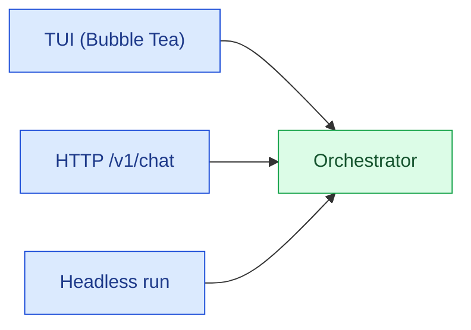

# CLI

The CLI layer (`internal/cli`) is the first non-`main` code that runs. It dispatches to the
correct subsystem handler based on the first argument, with no third-party router framework
(no Cobra, no urfave/cli).

## Design Philosophy

The CLI is a **routing-only layer**: it parses the argument list, resolves a command handler,
and delegates. It does not own business logic. All real work happens in the subsystem it
invokes — Orchestrator, Session, Memory, MCP, Plan, etc.

This keeps the CLI thin and prevents surface-layer state from leaking into subsystem tests.

## Command Dispatch

```
os.Args
    │
    ▼
internal/cli.Run(args)
    │
    ├─ "" / "--"          → TUI (interactive REPL)
    ├─ "run"              → One-shot Orchestrator turn
    ├─ "serve"            → HTTP server
    ├─ "init"             → Export .chronos-code/ defaults
    ├─ "login/logout/whoami" → Auth flow
    ├─ "providers"        → List resolvable providers
    ├─ "agents"           → List resolved agents
    ├─ "config"           → Show / validate merged config
    ├─ "session"          → Session CRUD
    ├─ "memory"           → Memory list / search / forget
    ├─ "mcp"              → MCP add / list / test / remove
    ├─ "learn"            → Learning suggestion management
    ├─ "eval"             → Offline eval harness
    ├─ "team"             → Team list / run
    ├─ "plan"             → Durable plan store ops
    ├─ "skills"           → Skill list / show
    └─ "version"          → Print version string
```

## Flag Parsing

Flags are parsed manually before dispatch. The following flags are recognized at the top level
and passed through to subsystems via a `RunConfig` struct:

| Flag | Type | Description |
|------|------|-------------|
| `-c` / `--config` | string | Path to a specific config file |
| `--debug` | bool | Enable debug logging |
| `--stream` / `--no-stream` | bool | Control streaming output |
| `--permission-mode` | string | `default` \| `auto` \| `strict` |
| `--yolo` | bool | Auto-approve policy-allowed tools |
| `--budget <usd>` | float | Hard USD cap for this invocation |
| `--resume <session-id>` | string | Resume a prior session by ID |
| `--json` | bool | Machine-readable (headless) output |
| `--db <path>` | string | Override storage path (plan ops) |

## Surfaces vs Runtime

The CLI wires three distinct surfaces to one shared runtime:



The TUI and HTTP server are **surfaces** — they do not talk to Chronos directly. All agent
turns go through Orchestrator, which owns the Chronos agent loop, guardrails, routing, and
session persistence.

## Subsystem Dispatch Table

| Sub-command | Handler package | Underlying subsystem |
|-------------|-----------------|----------------------|
| _(none)_ | `internal/tui` | Bubble Tea REPL |
| `run` | `internal/orchestrator` | One-shot turn |
| `serve` | `internal/server` | HTTP API |
| `init` | `internal/defaults` | Export embedded YAML |
| `login` / `logout` / `whoami` | `internal/auth` | Credential flow |
| `config show\|validate` | `internal/config` | Merged config display |
| `session` | `internal/session` | SQLite session store |
| `memory` | `internal/memory` | YAML memory store |
| `mcp` | `internal/mcpdiscover` | MCP lifecycle |
| `learn` | `internal/learning` | Suggestion management |
| `eval` | `internal/eval` | Offline harness |
| `team` | `internal/teambuilder` | Team definitions |
| `plan` | `internal/plan` | SQLite plan store |
| `skills` | `internal/skills` | Skill discovery |

## Error Handling

CLI errors follow a single pattern:

```go
// Print to stderr, exit non-zero
fmt.Fprintf(os.Stderr, "chronos-code %s: %v\n", subcommand, err)
os.Exit(1)
```

Subsystem errors are wrapped at the call site before being returned to the CLI:

```go
if err := orchestrator.Run(ctx, cfg, msg); err != nil {
    return fmt.Errorf("run: %w", err)
}
```

## Interactive TUI Slash Commands

Within the TUI surface, slash commands extend the CLI vocabulary at runtime:

| Slash Command | Effect |
|---------------|--------|
| `/login` | Authenticate with a provider |
| `/whoami` | Show effective credential source |
| `/context` | Show context budget and source breakdown |
| `/resume` | Resume the latest session |
| `/compact` | Summarize and compress conversation history |
| `/rewind` | Undo the last `file_write` operation |
| `/plan on\|off` | Toggle plan-gate mode (blocks writes/shell) |
| `/learn` | Review pending learning suggestions |
| `/model` | List available models; Tab to autocomplete |
| `/mouse` | Toggle mouse capture |
| `/copy` | Copy last reply to clipboard |
| `/think` | Enable native thinking for the current turn |

Slash commands are parsed by `internal/tui` before the input is handed to the Orchestrator.
The TUI handles them locally when they affect only UI state (e.g., `/mouse`), or dispatches to
the relevant subsystem when they have side effects (e.g., `/learn accept <id>`).

## See Also

- [Architecture Overview](./overview.md)
- [Orchestrator](./orchestrator.md)
- [Getting Started — Commands Reference](../getting-started#commands-reference)
