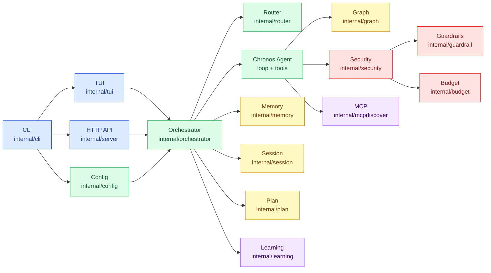
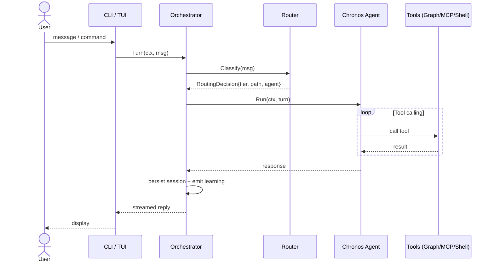

# Architecture Overview

Chronos Code is a thin orchestration harness on top of the
[Chronos](https://github.com/spawn08/chronos) agentic framework library. The framework handles
the agent loop, tool runtime, streaming, and storage adapters. Chronos Code adds:
YAML-driven configuration, a Go code graph, MCP integration, persistent memory, a
learning loop, and interactive surfaces (TUI and HTTP).

## High-Level Diagram



## Request Path



## Subsystems

### Entry & Surfaces

| Package | Role |
|---------|------|
| `cmd/chronos-code` | Binary `main` — thin entry point |
| `internal/cli` | Command dispatch (no Cobra); handles all sub-commands |
| `internal/tui` | Bubble Tea REPL: streaming display, approvals, slash commands |
| `internal/server` | HTTP API (`/v1/chat`, sessions, memory, teams) |

### Core Runtime

| Package | Role |
|---------|------|
| `internal/orchestrator` | Agent lifecycle, routing application, turn execution |
| `internal/config` | YAML discovery and merge across CLI/env/project/user/embed layers |
| `internal/defaults` | Embedded agents, skills, guardrails, routing (`go:embed`) |
| `internal/router` | Intent patterns, model routing, complexity paths, PPD policy |

### Workspace & Code Intelligence

| Package | Role |
|---------|------|
| `internal/workspace` | Project root, ignore rules, file indexing |
| `internal/graph` | Go AST graph (default); tree-sitter behind `treesitter` build tag |
| `internal/projectdocs` | Watches project docs for context injection |
| `internal/lsp` | Optional `lsp` tag: diagnostics, hover, references, rename preview |

### Context & Memory

| Package | Role |
|---------|------|
| `internal/session` | Session persistence and resume (SQLite) |
| `internal/memory` | Local YAML memory (project / user / feedback) |
| `internal/plan` | Durable PPD plan store and scheduler (SQLite) |
| `internal/skills` | Skill discovery and selection |
| `internal/activation` | Context window activation decisions |
| `internal/attention` | Attention-based relevance scoring |
| `internal/incctx` | Incremental context management |
| `internal/toolcompress` | Tool result compression for context budget |

### Safety & Security

| Package | Role |
|---------|------|
| `internal/security` | Path/shell policy, permissions, hooks, sandbox |
| `internal/guardrail` | YAML guardrail engine (injection, PII, secrets) |
| `internal/verification` | Report/enforce verification policy |
| `internal/budget` | Token and USD caps |
| `internal/auth` | API keys, OAuth, keychain, SSO |

### Integrations

| Package | Role |
|---------|------|
| `internal/mcpdiscover` | `.mcp.json` load, test, redact, runtime management |
| `internal/learning` | Trace → suggestion YAML; apply only after human review |
| `internal/teambuilder` | Multi-agent team definitions |
| `internal/eval` | Offline token-efficiency and PPD eval harness |

## Chronos vs Chronos Code

Chronos itself (`github.com/spawn08/chronos`) is a **library**: agent SDK, harness, tool
runtime, streaming, and storage adapters. Chronos Code does not reimplement the agent loop.

```
github.com/spawn08/chronos        ← library (agent loop, tool runtime, streaming)
github.com/spawn08/chronos-code   ← harness (YAML config, graph, MCP, TUI, learning)
```

## Subsystem Deep-Dives

- [Orchestrator](./orchestrator.md) — ToolPhase, ContextGuard, ContextReport
- [MCP](./mcp.md) — ManagedServer, Discover/Load/Runtime, security validation
- [Memory](./memory.md) — Recall store, session summaries, learning loop
- [Planning](./planning.md) — SQLStore.Graph, PlanScope, PlanRef
- [CLI](./cli.md) — Command dispatch, manual routing
- [Security](./security.md) — Guardrail stack, path policy, MCP trust
