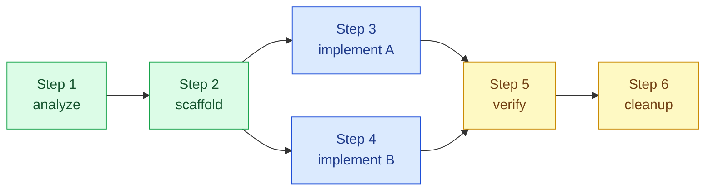
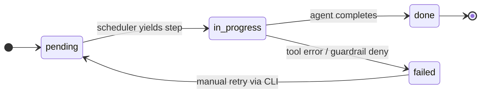

# Planning

The planning subsystem (`internal/plan`) provides a **durable, SQLite-backed plan store** for
decomposed programming tasks. It is the persistence layer for the PPD (Plan-Persist-Delegate)
routing mode and the `chronos-code plan` CLI commands.

## Motivation

Long-horizon coding tasks — refactors spanning many files, feature additions with multiple
discrete steps — need a store that survives process restarts and context compactions. The plan
store gives each step a unique identity, a status, and typed metadata so that a resumed session
can pick up exactly where it left off.

## Core Abstractions

### PlanRef

A `PlanRef` is an opaque, stable identifier for a single plan step. It is generated
deterministically from the plan's root and the step's position in the dependency graph:

```
PlanRef = base58(sha256(planID + ":" + stepIndex))
```

`PlanRef`s are safe to embed in agent messages; they survive plan mutations that add or remove
unrelated steps.

### PlanScope

`PlanScope` marks the blast radius of a plan step:

| Scope | Meaning |
|-------|---------|
| `file` | Affects a single file |
| `package` | Affects a Go package |
| `module` | Affects multiple packages or the module root |
| `cross` | Spans multiple modules or external dependencies |

The orchestrator uses `PlanScope` to set `--permission-mode` and to decide whether to request
explicit user approval before a step executes.

### SQLStore.Graph

`SQLStore.Graph` is the dependency graph of plan steps stored in SQLite. Each node is a step;
edges encode `DependsOn` relationships. The scheduler walks the graph in topological order,
yielding steps whose dependencies are all in the `done` state.



Steps 3 and 4 are **ready** (all dependencies done). Step 5 is **waiting** (dependencies
not yet complete). The scheduler yields 3 and 4 in parallel when the orchestrator supports
concurrent step execution.

## Step Lifecycle



## PPD Integration

When `ppd.mode: enabled` in `routing.yaml`, the orchestrator routes qualifying tasks through
the `ppd-planner` specialist agent. `ppd-planner` decomposes the task, writes a plan to the
SQLite store, and returns `PlanRef`s for each step. The orchestrator then schedules steps via
`SQLStore.Graph`.

PPD qualifying criteria:

- Explicit PPD keywords in the message (`plan`, `decompose`, `step-by-step`, etc.)
- High complexity path (`high` tier from the router)
- Breadth exceeding configured thresholds (files > 5, packages > 2, call-chain depth > 3)
- `@ppd-planner` direct mention

In `shadow` mode, routing decisions are recorded but `ppd-planner` is not invoked. This is
useful for evaluating PPD coverage without changing behavior.

## CLI Operations

```bash
# List all plans in the store
chronos-code plan list --db .chronos-code/sessions.db

# Show a specific plan with its step graph
chronos-code plan show <plan-id> --db .chronos-code/sessions.db

# Mark a failed step as pending for retry
chronos-code plan retry <plan-ref> --db .chronos-code/sessions.db

# Delete a plan (removes all steps and edges)
chronos-code plan delete <plan-id> --db .chronos-code/sessions.db
```

## Schema

The plan store uses three SQLite tables:

| Table | Columns | Description |
|-------|---------|-------------|
| `plans` | `id`, `title`, `scope`, `created_at`, `status` | Plan root metadata |
| `steps` | `ref`, `plan_id`, `title`, `scope`, `status`, `result`, `updated_at` | Individual steps |
| `edges` | `from_ref`, `to_ref` | Dependency edges (`from` must complete before `to`) |

The schema is created by `SQLStore.Init()` using embedded SQL — no external migration tool
required.

## Disabling the Plan Store

```yaml
# .chronos-code/config.yaml
plan:
  enabled: false
```

When disabled, `ppd.mode` is forced to `disabled` regardless of `routing.yaml`. Existing
`.chronos-code/sessions.db` plan tables are not dropped — re-enabling restores them.

## See Also

- [Orchestrator](./orchestrator.md) — how the orchestrator applies routing decisions
- [Architecture Overview](./overview.md) — where planning fits in the full system
- [Configuration — PPD routing](../configuration#routing-config-routingyaml)
