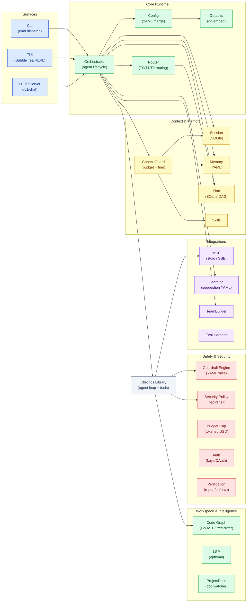

# Architecture Overview Diagram

This diagram shows the major subsystems of Chronos Code and how they interconnect.

## Key Relationships

| Relationship | Description |
|-------------|-------------|
| **CLI/TUI/HTTP → Orchestrator** | All surfaces funnel through a single Orchestrator instance |
| **Orchestrator → Chronos** | Orchestrator drives the Chronos agent loop; Chronos is a library, not a service |
| **Chronos → MCP** | Chronos tool runtime manages MCP server connections |
| **Chronos → Guardrail/Security** | All tool calls pass through the guardrail and security layers |
| **ContextGuard** | Mediates between Session, Memory, and Skills to enforce the token budget |
| **Orchestrator → Learning** | After each turn, emits pending suggestions for human review |

## See Also

- [Request Lifecycle](./request-lifecycle) — turn-by-turn sequence
- [MCP Discovery](./mcp-discovery) — MCP startup flow
- [Context Budget](./context-budget) — ContextGuard state machine
- [Data Flow](./data-flow) — Plan and Memory feedback loops
