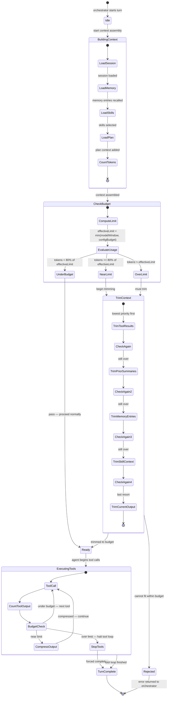

# Context Budget State Machine

This diagram shows how `ContextGuard` manages the context window budget across a turn.



## States Explained

| State | Description |
|-------|-------------|
| **Idle** | Waiting for a turn to start |
| **BuildingContext** | Assembling context: session + memory + skills + plan |
| **CheckBudget** | Computing `effectiveLimit = min(modelContextWindow, configuredBudget)` |
| **UnderBudget** | Token count is below 80% of effective limit — no trimming needed |
| **NearLimit** | 80–100% of limit — proactive trimming begins |
| **OverLimit** | Exceeds limit — trimming is required |
| **TrimContext** | Progressive trimming in priority order (lowest-priority sources first) |
| **Ready** | Context fits within budget; proceed to agent loop |
| **ExecutingTools** | Agent is calling tools; each output is budget-checked |
| **CompressOutput** | `toolcompress` compresses a tool result to fit |
| **StopTools** | Tool loop halted; context budget exhausted |
| **TurnComplete** | Turn finished (normally or via forced stop) |
| **Rejected** | Cannot fit even minimal context — error returned |

## Trim Priority Order

Trimming removes context from lowest to highest priority:

1. Historical tool results (non-current turn)
2. Prior session summaries
3. Memory injections (project / user / feedback)
4. Skill context
5. Current turn tool output (last resort)

## effectiveLimit Formula

```
effectiveLimit = min(modelContextWindow, configuredBudget)

where:
  modelContextWindow = maximum tokens for the selected model
  configuredBudget   = budget.tokens from config.yaml (0 = no limit)
```

When `configuredBudget = 0` (unset), `effectiveLimit = modelContextWindow`.

## See Also

- [Orchestrator — ContextGuard](../architecture/orchestrator#contextguard-budget-math)
- [Architecture Overview](./architecture-overview)
- [Configuration — Budget](../configuration#core-config-keys-configyaml)
