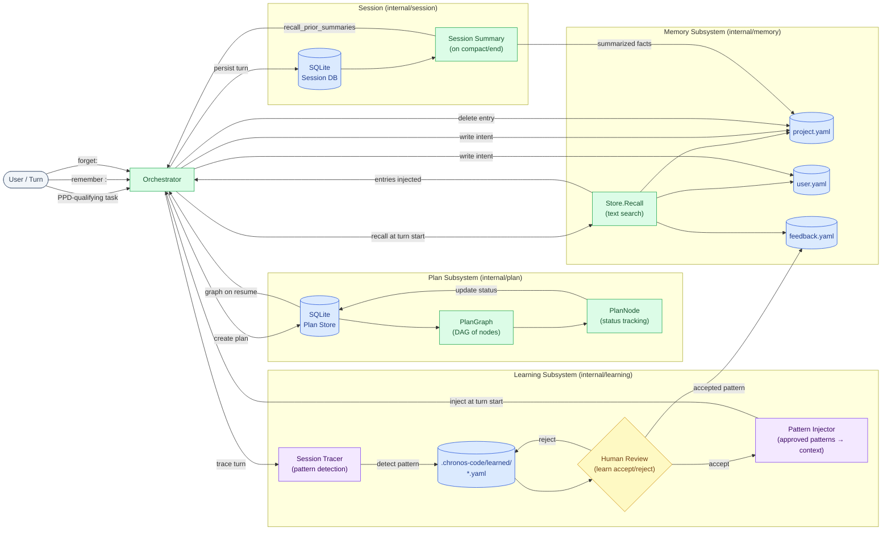

# Data Flow

This diagram shows how data flows between the Plan store, Memory store, and the Learning feedback loop — the three stateful subsystems that persist across sessions.

## Data Stores

| Store | Format | Location | Description |
|-------|--------|----------|-------------|
| Plan DB | SQLite | `--db <path>` | PPD plan DAGs and node status |
| Session DB | SQLite | `.chronos-code/sessions.db` | Session history and summaries |
| Project memory | YAML | `.chronos-code/memory/project.yaml` | Project-scoped facts |
| User memory | YAML | `~/.chronos-code/memory/user.yaml` | User preferences |
| Feedback memory | YAML | `.chronos-code/memory/feedback.yaml` | Accepted learning patterns |
| Suggestion files | YAML | `.chronos-code/learned/*.yaml` | Pending suggestions (pre-review) |

## Feedback Loops

### Memory → Context Loop

On every turn start:
1. `Store.Recall(ctx, query)` searches project + user + feedback YAML
2. Matching entries are injected into the context (budget-permitting)
3. High-relevance entries survive context trimming longer

### Learning Loop

1. Session tracer detects patterns during tool calls and model interactions
2. Patterns are written as YAML suggestion files
3. Human runs `chronos-code learn accept <id>` to activate
4. Accepted patterns are injected via `PatternInjector` on future turns
5. Accepted patterns are also written to `feedback.yaml` for recall

### Plan Resumption Loop

1. PPD-qualifying task creates a `PlanGraph` in SQLite
2. `ppd-planner` updates `PlanNode` status as it works
3. On `/resume` or `--resume <session-id>`, the orchestrator loads the plan from SQLite
4. Remaining nodes continue from where execution stopped

## See Also

- [Memory Architecture](../architecture/memory)
- [Plan Architecture](../architecture/plan)
- [Context Budget](./context-budget) — how memory entries compete for budget
