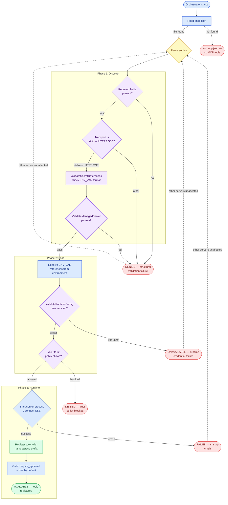

# MCP Discovery Flow

This flowchart shows the full lifecycle of MCP server startup, including both validation gates.

## Validation Gates

| Gate | Phase | What it checks | Failure outcome |
|------|-------|---------------|-----------------|
| `ValidateManagedServer` | Discover | Transport type, required fields, `${ENV_VAR}` format | Server marked **denied** |
| `validateRuntimeConfig` | Load | All referenced env vars are set in environment | Server marked **unavailable** |
| Trust policy | Load | Server allowed by `security.yaml` MCP trust config | Server marked **denied** |
| Startup | Runtime | Process starts / SSE connects successfully | Server marked **failed** |

## Failure Isolation

All failure outcomes are isolated — a failed server does not block healthy servers or chat. Failed servers produce a warning log entry at startup.

**Tip:** run `chronos-code mcp test` before starting a session to verify that all MCP servers pass both validation gates and connect successfully.

## See Also

- [MCP Architecture](../architecture/mcp) — detailed description
- [Configuration — MCP section](../configuration#mcp-configuration-mcpjson)
- [Security Architecture](../architecture/security) — `validateSecretReferences` detail
