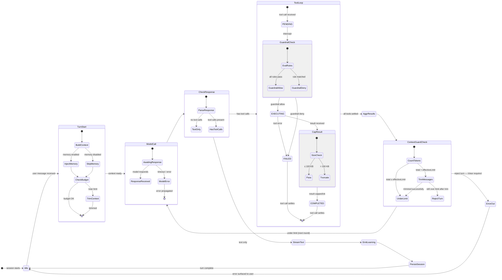

# Orchestrator Phases

This diagram shows the tool-calling loop state machine inside the Chronos orchestrator,
including `ToolPhase` states and the interaction with guardrails, the context guard, and
the model.

## ToolPhase State Machine

## Phase Descriptions

| Phase | Description |
|-------|-------------|
| **PENDING** | Tool call received from model; awaiting guardrail check |
| **EXECUTING** | Guardrail approved; tool handler is running |
| **COMPLETED** | Tool returned a result; result is capped to ≤ 100 KB |
| **FAILED** | Tool error or guardrail deny; error is included in tool result message |

## Key Design Decisions

### Guardrails Intercept at PENDING → EXECUTING

The guardrail engine intercepts **before** the tool handler runs. A guardrail deny sets state
to `FAILED` without any side effects from the tool. This prevents injection, secret leakage,
and destructive operations from being attempted.

### Tool Result Capping

Every tool result is capped at `maxToolResultBytes` (100 KB) by `wrapToolResultCap`. This is a
**last-resort safety net** after `toolcompress` has already compressed eligible results. It
prevents token-explosion from large tool outputs (e.g., MCP tools, context injections) that
bypass compression.

Source: `internal/orchestrator/context_guard.go` — `wrapToolResultCap`

### ContextGuard Fires After Every Tool Round

Unlike the SDK's `enforceContextBudget` (which runs once at session start), the
`contextGuardHook` fires **before every model call** via the `hooks.EventModelCallBefore` hook.
This catches token accumulation in follow-up rounds of the tool-calling loop.

Source: `internal/orchestrator/context_guard.go` — `contextGuardHook.Before`

### EmitLearning Before Session Persist

Learning suggestions are emitted **after** the turn completes but **before** the session is
persisted. This ensures that if session persistence fails, the learning suggestion is not lost
(it is written to disk independently).

## See Also

- [Context Budget State Machine](./context-budget) — ContextGuard detail
- [Orchestrator Subsystem](../subsystems/orchestrator) — full orchestrator reference
- [Request Lifecycle](./request-lifecycle) — end-to-end sequence diagram
