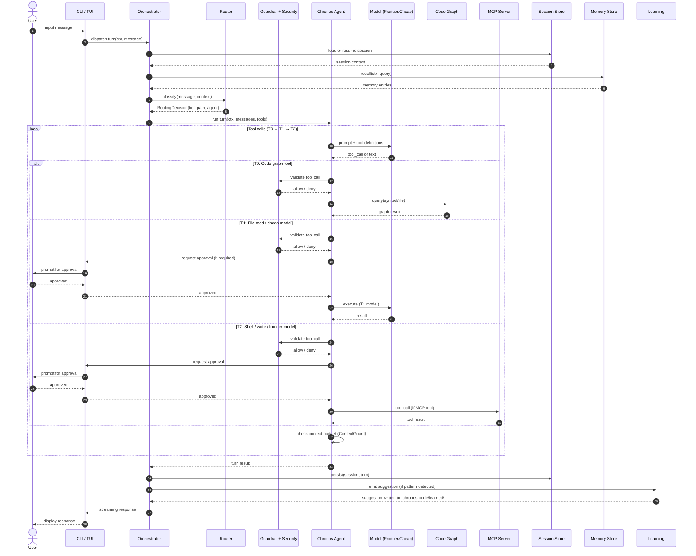

# Request Lifecycle

This sequence diagram traces a complete user request through all subsystems — from CLI input to the final response.

## Phase Summary

| Phase | Subsystems Involved | Description |
|-------|---------------------|-------------|
| **Context build** | Session, Memory | Load prior session; recall relevant memory entries |
| **Routing** | Router | Classify intent; select tier and implementation path |
| **Agent loop** | Agent, Model, Guardrail, Security | Iterative tool calls with budget tracking |
| **T0 tools** | Code Graph | Free graph queries — no model call, no approval |
| **T1 tools** | Model (cheap), Files | Ranged file reads, cheap model calls |
| **T2 tools** | Model (frontier), Shell, MCP | Writes, shell, MCP server calls — approval gated |
| **Post-turn** | Session, Learning | Persist session; emit learning suggestions |

## Tool Tier Costs

| Tier | Examples | Approval |
|------|----------|----------|
| T0 | `graph_query`, `codebase_search`, `find_callers` | Never |
| T1 | `file_read` (ranged), cheap model inference | Sometimes |
| T2 | `file_write`, `shell`, MCP tools | Always (unless `--yolo`) |

## See Also

- [Architecture Overview](./architecture-overview) — subsystem map
- [Context Budget](./context-budget) — how ContextGuard manages the token window
- [MCP Discovery](./mcp-discovery) — how MCP tools become available
